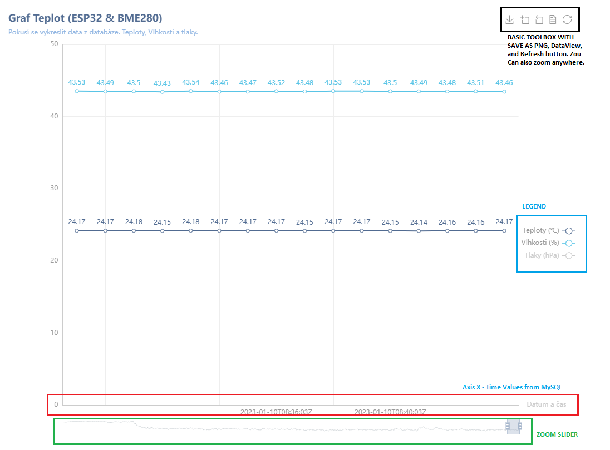
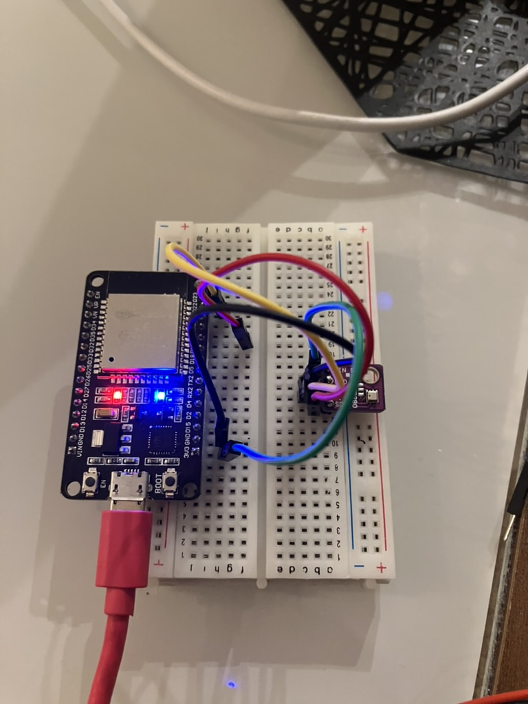

# PoC 
Trying to mess around with GoLang, prepare simple APi which will collect data from ESP32 + BME280 Module, uploads data to MySQL Database and will draw a line chart.

## Requirements
1. **ESP32** Dev Board
2. **BME280** Temperature sensor from Bosch
3. **MicroUSB Cable** / **Battery** or **USB 5V/1A** or other Source of energy
4. **Virtual** or **Cloud Machine** running **linux**
5. GoLang, VSCode, Arduino IDE
6. **Docker**, Podman or K8S for running Container.


## Introduction
At the beginning, I would like to mention here, that I'm not Arduiono specialist or programmer. I'm regular IT guy. I just wanted to try something new and different way. 

For basic understanding of things I've selected easy setup of Temperature measuring device. Since I have less knowledge of modern `APIs` or Containers I wanted to do it this way. 

## Rendering the Graph
GoLang API won't do much. Basically it can write data with `writedata` `func` to MySQL Database and It can draw simple line chart. Both are pretty simple functions. 



Data being sent from ESP32 device directly via `HTTP` `POST` requests. 

## ESP32 & BME280

Here is an example of how you can connect the BME280 sensor to the ESP32:

1. Connect the BME280 sensor to the ESP32 using the I2C interface. You will need to connect the SDA (data) and SCL (clock) lines of the sensor to the corresponding SDA and SCL pins on the ESP32. You will also need to connect the VCC and GND pins of the sensor to the appropriate power supply and ground pins on the ESP32.
2. Install the necessary libraries on your ESP32 board. You will need the "Adafruit BME280 Library" and the "Adafruit Unified Sensor Library" to use the BME280 sensor with the ESP32. You can install these libraries by going to Sketch > Include Library > Manage Libraries in the Arduino IDE and searching for the "Adafruit BME280" and "Adafruit Unified Sensor" libraries.
3. Initialize the BME280 sensor in your code by calling the begin() function of the Adafruit_BME280 class. You will need to pass the I2C address of the BME



## ESP 32 Example code could look like this

### C Language Code for ESP32 Device

This code uses the libcurl library to send an HTTP POST request to your GoLang server at the /writedata endpoint with the form data specified in the CURLOPT_POSTFIELDS option. The server will then handle the request and write the data to the database.

Keep in mind that you will need to replace "your-server-ip" with the actual IP address of your server. You can also modify the form data as needed to send different values for the time, temperature, humidity, and pressure.

```c
#include <stdio.h>
#include <curl/curl.h>

int main(void)
{
    CURL *curl;
    CURLcode res;

    curl = curl_easy_init();
    if(curl) {
        curl_easy_setopt(curl, CURLOPT_URL, "http://your-server-ip:8080/writedata");
        curl_easy_setopt(curl, CURLOPT_POSTFIELDS, "time=2022-01-01 12:00:00&temperature=25&humidity=50&pressure=1013");

        res = curl_easy_perform(curl);
        if(res != CURLE_OK) {
            fprintf(stderr, "curl_easy_perform() failed: %s\n", curl_easy_strerror(res));
        }

        curl_easy_cleanup(curl);
    }

    return 0;
}

```

### Direct MySQL Insert

```c
#include <stdio.h>
#include <stdlib.h>
#include <mysql/mysql.h>
#include <bme280.h>

#define HOST "localhost"
#define USER "dbuser"
#define PASSWORD "heslo"
#define DATABASE "temperature_db"

int main(int argc, char *argv[]) {
  // Initialize the BME280 sensor
  bme280_init();

  // Connect to the MySQL database
  MYSQL *conn = mysql_init(NULL);
  if (!mysql_real_connect(conn, HOST, USER, PASSWORD, DATABASE, 0, NULL, 0)) {
    fprintf(stderr, "%s\n", mysql_error(conn));
    return 1;
  }

  // Read data from the BME280 sensor
  float temperature = bme280_read_temperature();
  float humidity = bme280_read_humidity();
  float pressure = bme280_read_pressure();

  // Build the SQL query
  char query[256];
  sprintf(query, "INSERT INTO data (temperature, humidity, pressure) VALUES (%f, %f, %f)", temperature, humidity, pressure);

  // Execute the query
  if (mysql_query(conn, query)) {
    fprintf(stderr, "%s\n", mysql_error(conn));
    return 1;
  }

  // Close the connection
  mysql_close(conn);

  return 0;
}
```
## Few suggestions

1. Make sure that your GoLang API is running and accessible from the ESP32. You can test this by trying to access the API from your web browser or by using a CURL command like the one I provided in my previous message.
2. Make sure that the WiFi connection on the ESP32 is stable and that it can reach the GoLang API server. You can check the status of the WiFi connection by looking at the serial output from the ESP32.
3. Make sure that the sendDataToAPI function is being called correctly. You can check this by adding some debug statements in the function to print out the values of the temperature, humidity, and pressure variables.
4. If you are still having trouble, you may want to check the error messages that are being printed by the GoLang API. This can help you identify any problems with the API itself or with the data that is being sent to the API.

